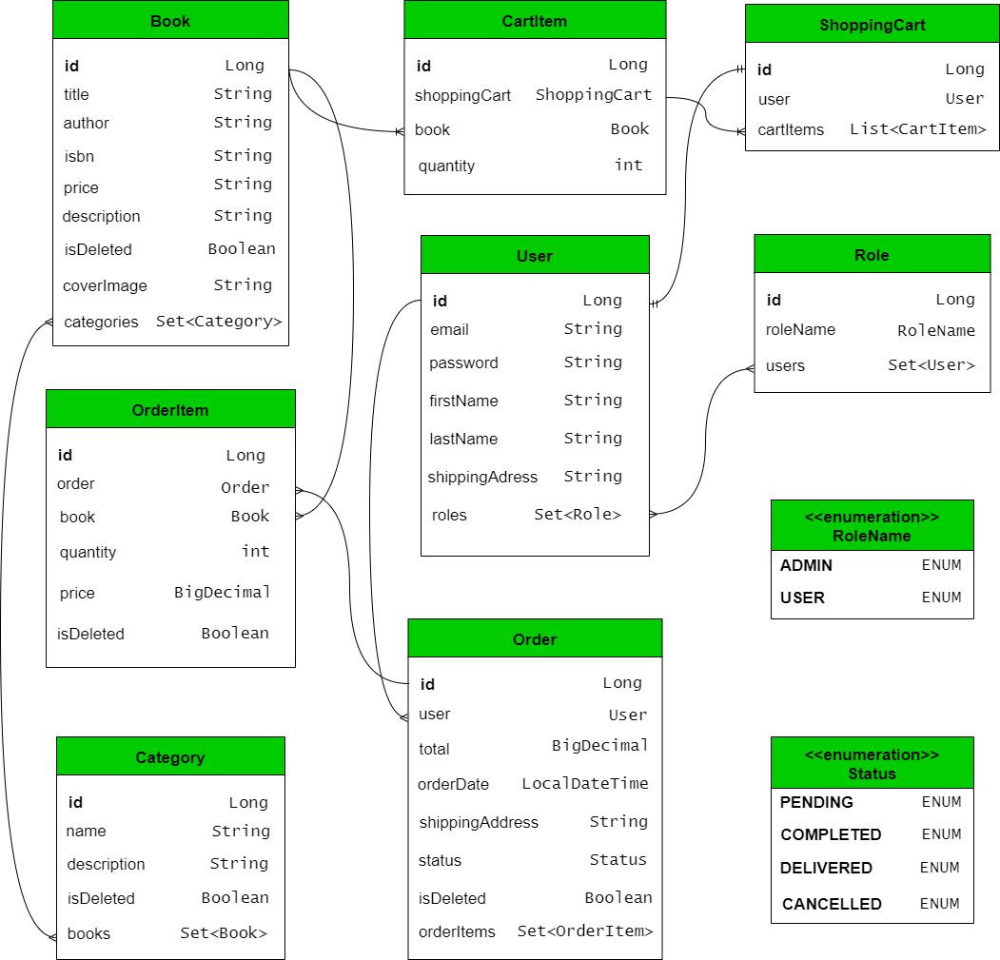

# 📚 BookStore Application - Spring Boot Back-End


## 📌 Introduction

**BookStore** is a fully-featured application developed as part
of my Java Back-End engineering learning journey. It replicates the core  
functionality of a modern online bookstore and demonstrates how real e-commerce systems handle:

- authorization & authentication
- catalog management
- shopping cart workflow
- and order processing


The goal of this project is not simply to build CRUD endpoints, but to design
a **clean, scalable, and secure architecture** that follows production-grade principles such as:

- layered architecture
- DTO mapping
- custom exception handling
- SpecificationProvider
- SpecificationBuilder
- service-level security
- JWT-based authentication
- service-level validation
- liquibase
- mocking and integration testing
- MySQL database


## 🎯 Motivation

This project was motivated by the desire to build something more complex than a basic REST API -
a system that reflects real business logic and can serve as a foundation for
enterprise-level services

While working on BookStore, I focused on solving several important engineering problems:

- 🔗 How to manage entity relationships professionally(OneToOne, OneToMany,
  ManyToOne, ManyToMany, to join tables)?
- 🔄 How to avoid common issues such as recursion during serialization?
- 🔐 How to implement secure JWT authentication with roles?
- 🧩 How to organize controllers, services, and repositories into clean architecture?
- 🧪 How to write mocking and integration tests that simulate real workflow
  (register -> login -> add books -> create order)?
- 📦 How to design predictable REST endpoints for real clients?
- 🛒 How to correctly implement a shopping cart(add item, update quantity,
  merge items)?

During development, I faced and solved challenges related to transaction management,
DTO design, Spring Security pitfalls, JPA lazy loading behavior, Spring Boot Testing pitfalls, and error handling.
These hurdles significantly strengthened my understanding of back-end engineering.


## 🚀 What this project demonstrates

Bookstore is not just a learning exercise - it is a demonstration of engineering mindset:


- 🧠 Clean and maintainable system design
- ✨ Readable and structure business logic
- 🌍 Real-world use cases and workflow
- 📐 Application of professional patterns used in production
- 📚 Influence from high-quality open-source projects

The project became my practical playground for experimenting with architecture,
security, database, modeling, and writing code that meets production-quality standards.


## 📌 Features / Functionality

This BookStore project demonstrates core back-end functionalities of a modern
online bookstore.
It is designed to simulate real-world e-commerce scenarios and provide
a foundation for production-level services.

 👤 **User registration and Authentication**       
 - Register and login
 - JWT tokens issuance
 - Role-based access control (USER / ADMIN) 

📚 **Book management**
- Create, read, update, and delete books
- REST-based catalog management
- Works with DTOs, validation, exception handling

🛒 **Shopping cart workflow**
- Add books to the shopping cart
- Increase / decrease quantity
- Merge identical cart-items
- View current cart-items contents

📦 **Order processing**
- Generate an order from the shopping cart
- Store order history for each user

🔍 **Filtering and searching**
- Powered by **SpecificationProvider** and  **SpecificationBuilder**
- Dynamic filtering and extendable architecture

✅ **Validation**
- Spring Validation annotations on all DTOs 

🔐 **Security**
- JWT authentication
- Role-based access per endpoint
- Service-level permission checks

🧪 **Testing**
- Mocking-based service tests
- Integration tests simulating real workflows


Overall, this section  demonstrates how the back-end supports a full shopping experience:
**`register → login → browse catalog → add books → manage shopping cart → place order`**


## 🏗 Architecture & Technology Stack
This project is designed with **production-grade architecture** in mind.  
It follows a **layered architecture** pattern to separate concerns and ensure maintainability:

- **Presentation Layer / Controller**: Handles HTTP requests and responses. Implements RESTful endpoints.
- **Service Layer**: Contains business logic, validation, and transaction management.
- **Repository Layer**: Interacts with the database using Spring Data JPA.
- **DTO Layer**: Transfers data between layers and ensures a clean API contract.
- **SpecificationProvider & SpecificationBuilder**: Enable dynamic filtering and searching of books.
- **Security Layer**: Handles authentication (JWT) and role-based authorization.
- **Exception Handling**: Custom exceptions with global handlers for predictable API responses.
- **Testing Layer(Spring Boot Testing)**: Ensures application reliability and correctness through mock and integration tests.


## Technology Stack
| Technology / Tool               | Version        | Purpose                                                                                                      |
|---------------------------------|----------------|--------------------------------------------------------------------------------------------------------------|
| Java                            | 19             | Core programming language                                                                                    |
| Spring Boot                     | 3.2.4          | Application framework                                                                                        |
| Spring Security + JWT           | 6.2.3 + 0.11.5 | Authentication & authorization                                                                               |
| MySQL                           | 8.3            | Database                                                                                                     |
| Hibernate                       | 6.4.4.Final    | ORM framework; handles database persistence, mapping Java entities to database tables , and query generation |
| Liquibase                       | 4.24           | Database migration & versioning                                                                              |                                                                                                                                                                         |
| Mocking & Integration Testing   | 5.7            | Mock and integration testing of application layers                                                           |
| Docker                          | 27.1.1         | Containerization of application & MySQL DB                                                                   |
| Docker Compose                  | 2.29.1         | Orchestrates containers                                                                                      |
| Swagger                         | 5.13           | API documentation & testing                                                                                  |

## Design Patterns && Architecture Concepts
| Concept / Pattern               | Purpose                               |
|---------------------------------|---------------------------------------|
| Layered Architecture            | Maintainable, scalable system         |
| Repository Pattern              | Clean separation of data access logic |
| SpecificationProvider & Builder | Dynamic filtering/search in catalog   |
| Validation (Spring Validation)  | DTO input validation                  |

## UML Diagram  


## 🐳 Infrastructure & Deployment
The application is fully containerized using Docker and Docker Compose, 
allowing anyone to run the project without manual environment configuration.


- **Docker**   
Used to package the Spring Boot application with a predefined Java runtime environment.
 
    
- **Docker Compose**  
Orchestrates multiple containers:
- Spring Boot Application
- MySQL database

This approach ensures consistent behavior across different machines 
and reflects real-world production deployment practices.

## 🛠 Local Setup / Getting Started
The BookStore application is fully containerized and can be started locally
without manual database setup, liquibase configuration, or environment tuning.

All required dependencies(Spring Boot application, MySQL database, liquibase migrations)
are preconfigured and run inside Docker containers.
 
### 1. Prerequisites
Make sure you have the following software installed:

- **Docker 27.1.1** 
- **Docker Compose 2.29.1** 
- **A web browser (to access Swagger UI)**

Check installed versions:
```bash
docker --version
docker compose version
```

### 2. Clone the Repository  
 ```bash  
  git clone https://github.com/VitaliyProgrammer/bookstore.git
  cd bookstore
  ```

▶️Run the Application (Docker)
Start the full application stack using Docker Compose:
```bash 
docker compose up --build 
```

This command will: 
- **build the Spring Boot application image**
- **start the MySQL database container**
- **automatically apply liquibase migrations**
- **launch the application in a ready-to-use state** 

🛑 Stop the Application
```bash
docker compose down
```

📦 Docker Image
The application image is available on Docker Hub: 
```bash
docker pull vitaliyjavaprog/bookstore:1.0.1
```

## 📘 API Documentation
All endpoints are documented in Swagger UI:
[Open Swagger UI](http://localhost:8080/swagger-ui/index.html)
                                                   


## 🎥 Video Presentation
A short video walk through of the BookStore application, including authentication
Swagger API demonstration, and order workflow, is available here:

👉 https://www.loom.com/share/0042f5def4ba49178c5b711cf35212fc


## 📌 Final Notes
This project reflects my approach to back-end engineering: thoughtful architecture,
clear separation of concerns, security-first design, and realistic workflows. It is
intended as both a learning milestone and a foundation for future production-ready systems.